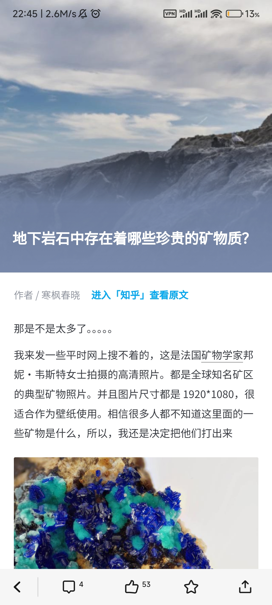

# Zhihu Daily 2024 for Flutter Starters

👋 Hello starters, this is your first lesson on how to write an App in Flutter.

>In this course, you will learn:
>
>1. Layout
>2. Infinite Scroll
>3. Pull to Refresh
>4. Web Request (When & How)
>5. Page Router
>6. Animation

😆 Let's finish this together... 

# 📓 Lesson 1: The Goal 

🎯 The purpose of this project is to write an App called `Zhihu Daily`. You may download the original version of this App to see the result.

Final Result

🦾 It contains three main functions:

1. 🖼️ The Sweepers image on the first page.
2. 📈 The tile list on the main page, which is grouped by date. As the user scrolls down, it will automatically refresh with new data.
3. 📰 The article preview and sharing functionality.

Now, let's implement these one by one.

Since this is a Flutter tutorial, we will not cover the backend part, we are going to directly use the exist Zhihu's API. It has already been completed for you and the documentation has been prepared. You just need to refer to it when you use it.

You may find the API reference at [🔗Here](https://github.com/RQ527/ZHIHUAPI)
